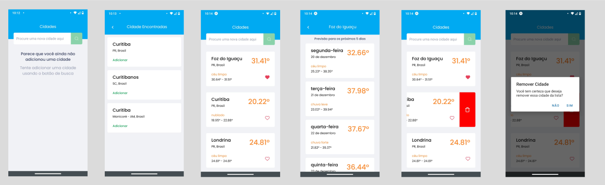

<h1 align="center">
  Open Weather
</h1>

<h4 align="center">App desenvolvido em React Native, utilizando Expo e TypeScript</h4>

## :rocket: Como executar

<ul>
  <li>Instalar no seu celular o app Expo Go</li>
  <li>Clonar o projeto em seu computador</li>
  <li>No diretório raiz, executar o comando yarn pra instalar as dependências do projeto</li>
  <li>Copiar o arquivo env.example.ts e renomer para env.ts e colocar as keys do googleApi e openWeatherApi</li>
  <li>Executar expo start para iniciar a aplicação</li>
  <li>Abrir o app Epo Go e faça o scan do QRcode</li>
</ul>

## :speech_balloon: Funcionalidades

<ul>
  <li>Busca de cidades</li>
  <li>Adiciona cidades que foram filtradas para exibição da temperatura atual</li>
  <li>Listagem das cidades salvas com opção de favoritar a cidade</li>
  <li>Tela de detalhe da cidade que exibe a previsão do tempo para os próximos dias</li>
  <li>Remoção da cidade da lista de cidades salvas</li>
  <li>Persistência de dados das cidades salvas usando Async Storage</li>
</ul>

## :iphone: Recursos Aplicados

<ul>
  <li>Navegação entre páginas</li>
  <li>Async Storage (Banco de dados local)</li>
  <li>Styled Components</li>
  <li>React Animation</li>
  <li>Lottie</li>
</ul>

## ⌨️ Tecnologias

<ul>
  <li>React Native</li>
  <li>Date-fns</li>
  <li>TypeScript</li>
  <li>Expo</li>
  <li>Google Place Api</li>
  <li>Open Weather Api</li>
</ul>
